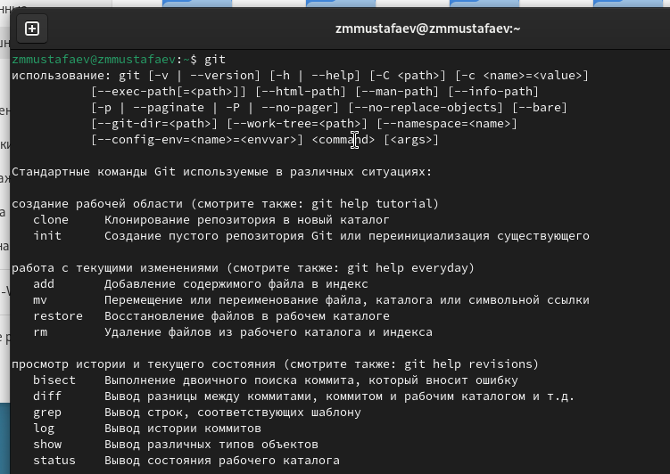
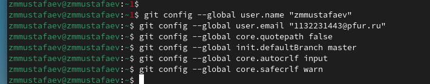
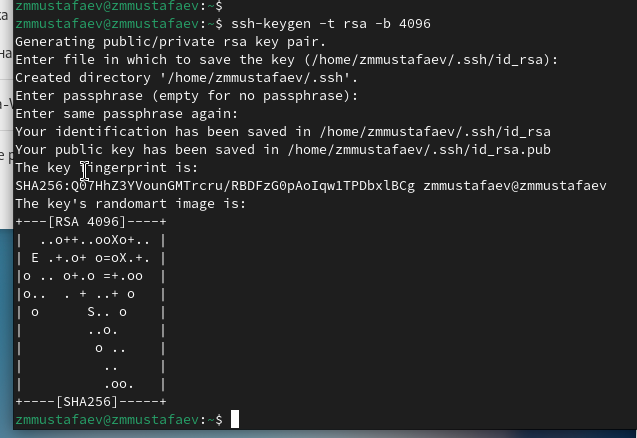
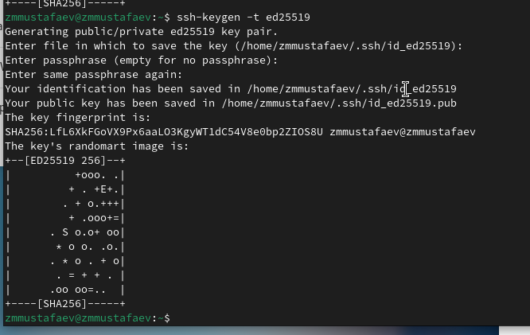
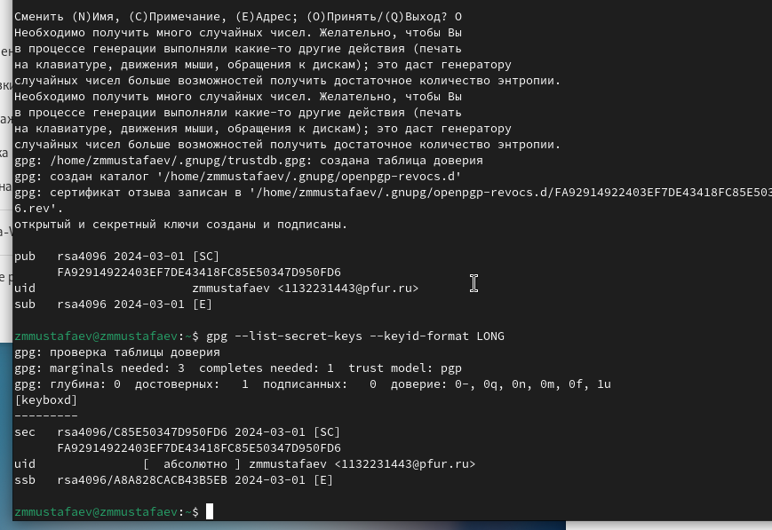
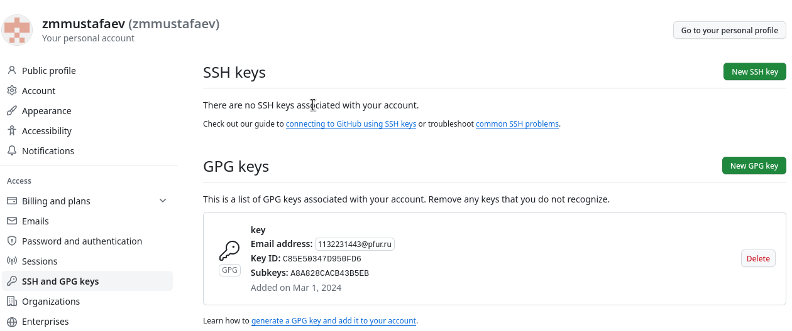
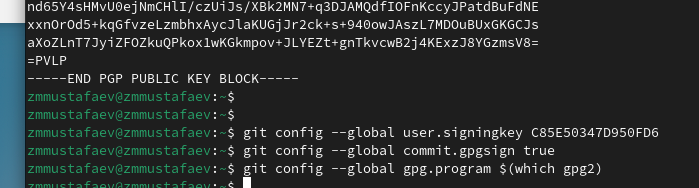
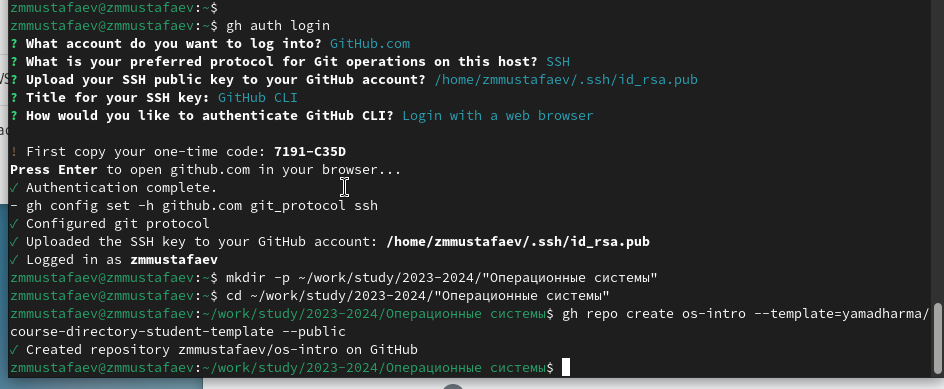
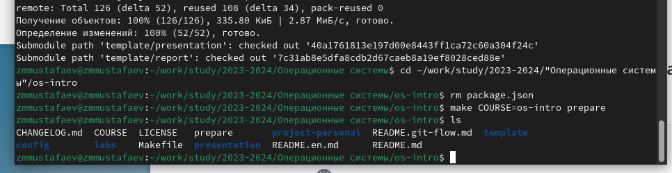
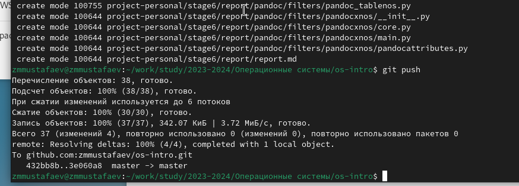

---
# Front matter
lang: ru-RU
title: "Отчёт по лабораторной работе №2"
subtitle: "Управление версиями"
author: "Заур Мустафаев"

# Formatting
toc-title: "Содержание"
toc: true # Table of contents
toc_depth: 2
lof: true # List of figures
fontsize: 12pt
linestretch: 1.5
papersize: a4paper
documentclass: scrreprt
polyglossia-lang: russian
polyglossia-otherlangs: english
mainfont: PT Serif
romanfont: PT Serif
sansfont: PT Sans
monofont: PT Mono
mainfontoptions: Ligatures=TeX
romanfontoptions: Ligatures=TeX
sansfontoptions: Ligatures=TeX,Scale=MatchLowercase
monofontoptions: Scale=MatchLowercase
indent: true
pdf-engine: lualatex
header-includes:
  - \linepenalty=10 # the penalty added to the badness of each line within a paragraph (no associated penalty node) Increasing the value makes tex try to have fewer lines in the paragraph.
  - \interlinepenalty=0 # value of the penalty (node) added after each line of a paragraph.
  - \hyphenpenalty=50 # the penalty for line breaking at an automatically inserted hyphen
  - \exhyphenpenalty=50 # the penalty for line breaking at an explicit hyphen
  - \binoppenalty=700 # the penalty for breaking a line at a binary operator
  - \relpenalty=500 # the penalty for breaking a line at a relation
  - \clubpenalty=150 # extra penalty for breaking after first line of a paragraph
  - \widowpenalty=150 # extra penalty for breaking before last line of a paragraph
  - \displaywidowpenalty=50 # extra penalty for breaking before last line before a display math
  - \brokenpenalty=100 # extra penalty for page breaking after a hyphenated line
  - \predisplaypenalty=10000 # penalty for breaking before a display
  - \postdisplaypenalty=0 # penalty for breaking after a display
  - \floatingpenalty = 20000 # penalty for splitting an insertion (can only be split footnote in standard LaTeX)
  - \raggedbottom # or \flushbottom
  - \usepackage{float} # keep figures where there are in the text
  - \floatplacement{figure}{H} # keep figures where there are in the text
---

# Цель работы

Целью данной работы является изучение идеологии и применения средств контроля версий и освоение умений работать с git.

# Выполнение лабораторной работы

Устанавливаем git, git-flow и gh.

{ #fig:001 width=70% height=70% }

Зададим имя и email владельца репозитория, кодировку и прочие параметры.

{ #fig:002 width=70% height=70% }

Создаем SSH ключи

{ #fig:003 width=70% height=70% }

{ #fig:004 width=70% height=70% }

Создаем GPG ключ

{ #fig:005 width=70% height=70% }

Добавляем GPG ключ в аккаунт

{ #fig:006 width=70% height=70% }

Настройка автоматических подписей коммитов git

{ #fig:007 width=70% height=70% }

Настройка gh

{ #fig:008 width=70% height=70% }

Загрузка шаблона репозитория и синхронизация

{ #fig:009 width=70% height=70% }

Подготовка репозитория и коммит изменений

{ #fig:010 width=70% height=70% }

# Вывод

Мы приобрели практические навыки работы с сервисом github.

# Контрольные вопросы

1. Что такое системы контроля версий (VCS) и для решения каких задач они предназначаются?

Системы контроля версий (Version Control System, VCS) применяются при работе нескольких человек над одним проектом. Обычно основное дерево проекта хранится в локальном
или удалённом репозитории, к которому настроен доступ для участников проекта. При
внесении изменений в содержание проекта система контроля версий позволяет их
фиксировать, совмещать изменения, произведённые разными участниками проекта,
производить откат к любой более ранней версии проекта, если это требуется

2. Объясните следующие понятия VCS и их отношения: хранилище, commit, история, рабочая копия.

* хранилище - пространство на накопителе где расположен репозиторий
* commit - сохранение состояния хранилища 
* история - список изменений хранилища (коммитов)
* рабочая копия - локальная копия сетевого репозитория, в которой работает программист. Текущее состояние файлов проекта, основанное на версии, загруженной из хранилища (обычно на последней)

3. Что представляют собой и чем отличаются централизованные и децентрализованные VCS? Приведите примеры VCS каждого вида.

Централизованные системы контроля версий представляют собой приложения типа клиент-сервер, когда репозиторий проекта существует в единственном экземпляре и хранится на сервере. Доступ к нему осуществлялся через специальное клиентское приложение. В качестве примеров таких программных продуктов можно привести CVS, Subversion.

Распределенные системы контроля версий (Distributed Version Control System, DVCS) позволяют хранить репозиторий (его копию) у каждого разработчика, работающего с данной системой. При этом можно выделить центральный репозиторий (условно), в который будут отправляться изменения из локальных и, с ним же эти локальные репозитории будут синхронизироваться. При работе с такой системой, пользователи периодически синхронизируют свои локальные репозитории с центральным и работают непосредственно со своей локальной копией. После внесения достаточного количества изменений в локальную копию они (изменения) отправляются на сервер. При этом сервер, чаще всего, выбирается условно, т.к. в большинстве DVCS нет такого понятия как “выделенный сервер с центральным репозиторием”.

4. Опишите действия с VCS при единоличной работе с хранилищем.

Один пользователь работает над проектом и по мере необходимости делает коммиты, сохраняя определенные этапы.

5. Опишите порядок работы с общим хранилищем VCS.

Несколько пользователей работают каждый над своей частью проекта. При этом каждый должен работать в своей ветки. При завершении работы ветка пользователя сливается с основной веткой проекта. 

6. Каковы основные задачи, решаемые инструментальным средством git?

* Ведение истории версий проекта: журнал (log), метки (tags), ветвления (branches).
* Работа с изменениями: выявление (diff), слияние (patch, merge).
* Обеспечение совместной работы: получение версии с сервера, загрузка обновлений на сервер.

7. Назовите и дайте краткую характеристику командам git.

* git config - установка параметров
* git status - полный список изменений файлов, ожидающих коммита
* git add . - сделать все измененные файлы готовыми для коммита.
* git commit -m "[descriptive message]" - записать изменения с заданным сообщением.
* git branch - список всех локальных веток в текущей директории.
* git checkout [branch-name] - переключиться на указанную ветку и обновить рабочую директорию.
* git merge [branch] — соединить изменения в текущей ветке с изменениями из заданной.
* git push - запушить текущую ветку в удаленную ветку.
* git pull - загрузить историю и изменения удаленной ветки и произвести слияние с текущей веткой.

8. Приведите примеры использования при работе с локальным и удалённым репозиториями.

* git remote add [имя] [url] — добавляет удалённый репозиторий с заданным именем;
* git remote remove [имя] — удаляет удалённый репозиторий с заданным именем;
* git remote rename [старое имя] [новое имя] — переименовывает удалённый репозиторий;
* git remote set-url [имя] [url] — присваивает репозиторию с именем новый адрес;
* git remote show [имя] — показывает информацию о репозитории.

9. Что такое и зачем могут быть нужны ветви (branches)?

Ветвление — это возможность работать над разными версиями проекта: вместо одного списка с упорядоченными коммитами история будет расходиться в определённых точках. Каждая ветвь содержит легковесный указатель HEAD на последний коммит, что позволяет без лишних затрат создать много веток. Ветка по умолчанию называется master, но лучше назвать её в соответствии с разрабатываемой в ней функциональностью.

10. Как и зачем можно игнорировать некоторые файлы при commit?

Зачастую нам не нужно, чтобы Git отслеживал все файлы в репозитории, потому что в их число могут входить: