---
# Front matter
lang: ru-RU
title: "Отчёт по лабораторной работе №4"
subtitle: "Продвинутое использование git"
author: "Заур Мустафаев"

lang: ru-RU
bibliography: bib/cite.bib
csl: pandoc/csl/gost-r-7-0-5-2008-numeric.csl

# Formatting
toc-title: "Содержание"
toc: true # Table of contents
toc_depth: 2
lof: true # List of figures
fontsize: 12pt
linestretch: 1.5
papersize: a4paper
documentclass: scrreprt
polyglossia-lang: russian
polyglossia-otherlangs: english
mainfont: PT Serif
romanfont: PT Serif
sansfont: PT Sans
monofont: PT Mono
mainfontoptions: Ligatures=TeX
romanfontoptions: Ligatures=TeX
sansfontoptions: Ligatures=TeX,Scale=MatchLowercase
monofontoptions: Scale=MatchLowercase
babel-lang: russian
babel-otherlangs: english
biblatex: true
biblio-style: "gost-numeric"
biblatexoptions:
  - parentracker=true
  - backend=biber
  - hyperref=auto
  - language=auto
  - autolang=other*
  - citestyle=gost-numeric
figureTitle: "Рис."
tableTitle: "Таблица"
listingTitle: "Листинг"
lofTitle: "Список иллюстраций"
lotTitle: "Список таблиц"
lolTitle: "Листинги"
indent: true
pdf-engine: lualatex
header-includes:
  - \linepenalty=10 # the penalty added to the badness of each line within a paragraph (no associated penalty node) Increasing the value makes tex try to have fewer lines in the paragraph.
  - \interlinepenalty=0 # value of the penalty (node) added after each line of a paragraph.
  - \hyphenpenalty=50 # the penalty for line breaking at an automatically inserted hyphen
  - \exhyphenpenalty=50 # the penalty for line breaking at an explicit hyphen
  - \binoppenalty=700 # the penalty for breaking a line at a binary operator
  - \relpenalty=500 # the penalty for breaking a line at a relation
  - \clubpenalty=150 # extra penalty for breaking after first line of a paragraph
  - \widowpenalty=150 # extra penalty for breaking before last line of a paragraph
  - \displaywidowpenalty=50 # extra penalty for breaking before last line before a display math
  - \brokenpenalty=100 # extra penalty for page breaking after a hyphenated line
  - \predisplaypenalty=10000 # penalty for breaking before a display
  - \postdisplaypenalty=0 # penalty for breaking after a display
  - \floatingpenalty = 20000 # penalty for splitting an insertion (can only be split footnote in standard LaTeX)
  - \raggedbottom # or \flushbottom
  - \usepackage{indentfirst}
  - \usepackage{float} # keep figures where there are in the text
  - \floatplacement{figure}{H} # keep figures where there are in the text
---

# Цель работы

Получение навыков правильной работы с репозиториями git.

# Теоретические сведения

* Gitflow Workflow опубликована и популяризована Винсентом Дриссеном.

* Gitflow Workflow предполагает выстраивание строгой модели ветвления с учётом выпуска проекта.

* Данная модель отлично подходит для организации рабочего процесса на основе релизов.

* Работа по модели Gitflow включает создание отдельной ветки для исправлений ошибок в рабочей среде.

* Последовательность действий при работе по модели Gitflow:

* Из ветки master создаётся ветка develop.

* Из ветки develop создаётся ветка release.

* Из ветки develop создаются ветки feature.

* Когда работа над веткой feature завершена, она сливается с веткой develop.

* Когда работа над веткой релиза release завершена, она сливается в ветки develop и master.

* Если в master обнаружена проблема, из master создаётся ветка hotfix.

* Когда работа над веткой исправления hotfix завершена, она сливается в ветки develop и master.

# Выполнение лабораторной работы

## Работа с тестовым репозиторием

Для работы с Node.js добавим каталог с исполняемыми файлами, 
устанавливаемыми yarn, в переменную PATH.

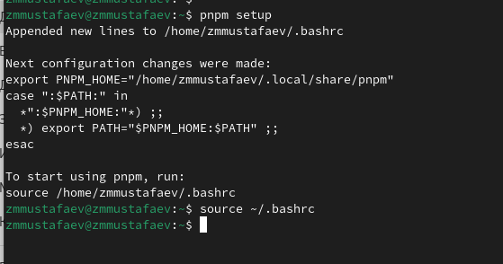{ #fig:001 width=70% height=70% }

Программа commitizen используется для помощи в форматировании коммитов.
При этом устанавливается скрипт git-cz, который мы и будем использовать для коммитов.

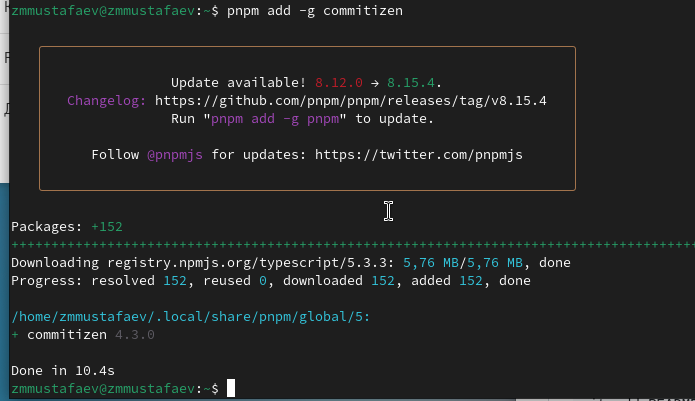{ #fig:002 width=70% height=70% }

Программа standard-changelog используется для помощи в создании логов.

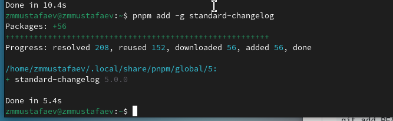{ #fig:003 width=70% height=70% }

Делаем первый коммит и выкладываем на github.

Необходимо заполнить несколько параметров пакета.

Таким образом, файл package.json приобретает вид:

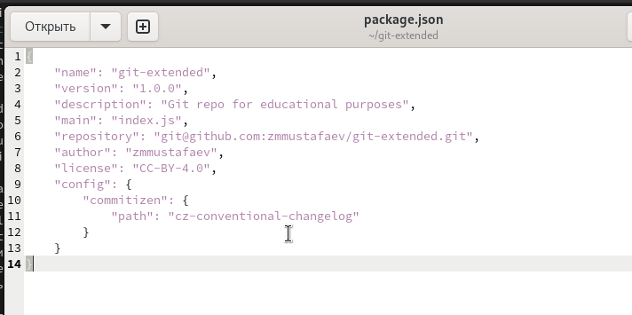{ #fig:004 width=70% height=70% }

Добавим новые файлы.

Выполним коммит.

Отправим на github.

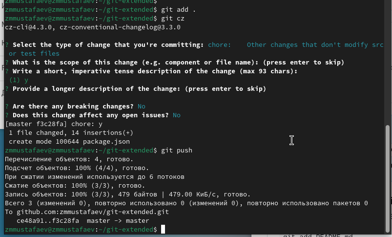{ #fig:005 width=70% height=70% }

Инициализируем git-flow

Проверьте, что Вы на ветке develop

Загрузите весь репозиторий в хранилище

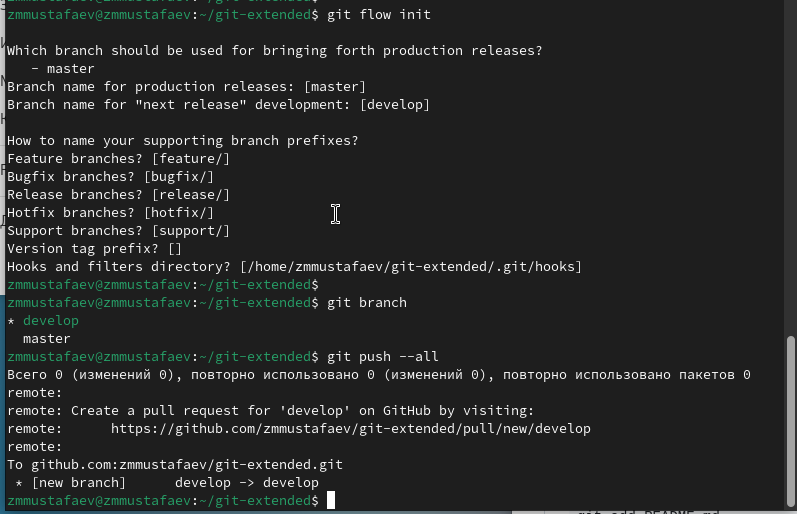{ #fig:006 width=70% height=70% }

Установите внешнюю ветку как вышестоящую для этой ветки

Создадим релиз с версией 1.0.0

Создадим журнал изменений

Добавим журнал изменений в индекс

Зальём релизную ветку в основную ветку

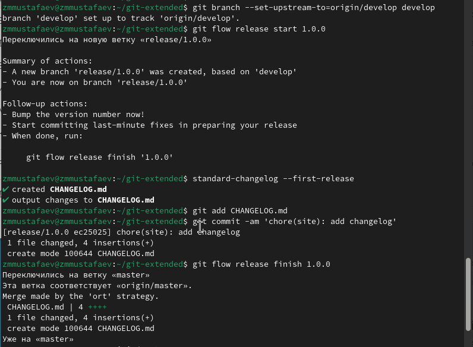{ #fig:007 width=70% height=70% }

Отправим данные на github

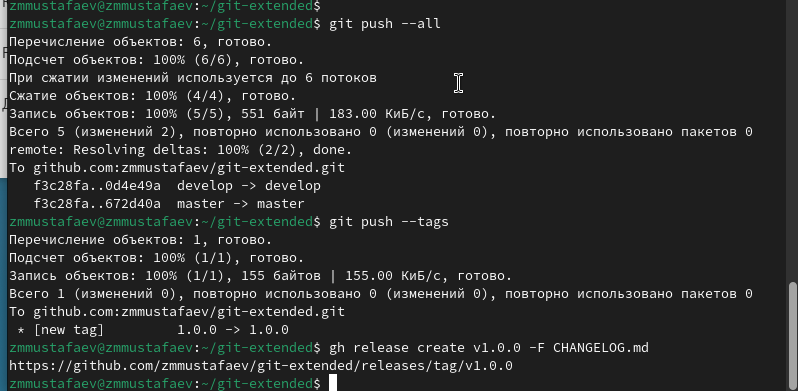{ #fig:008 width=70% height=70% }

Создадим ветку для новой функциональности
По окончании разработки новой функциональности следующим шагом следует объединить ветку feature_branch c develop:

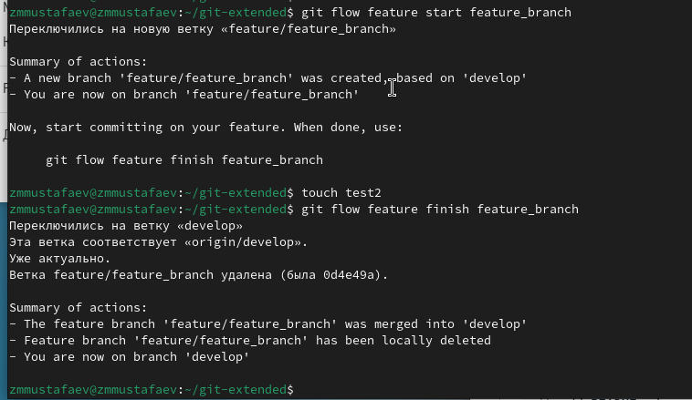{ #fig:009 width=70% height=70% }

Создадим релиз с версией 1.2.3

Обновите номер версии в файле package.json. Установите её в 1.2.3

Создадим журнал изменений

Добавим журнал изменений в индекс

Зальём релизную ветку в основную ветку

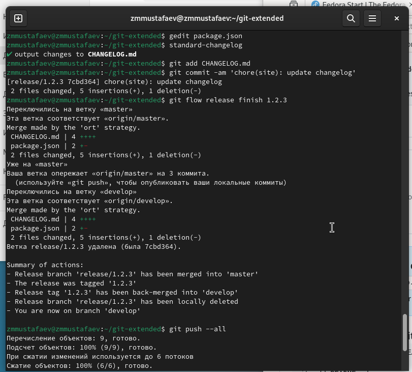{ #fig:010 width=70% height=70% }

## Подготовка рабочего репозитория

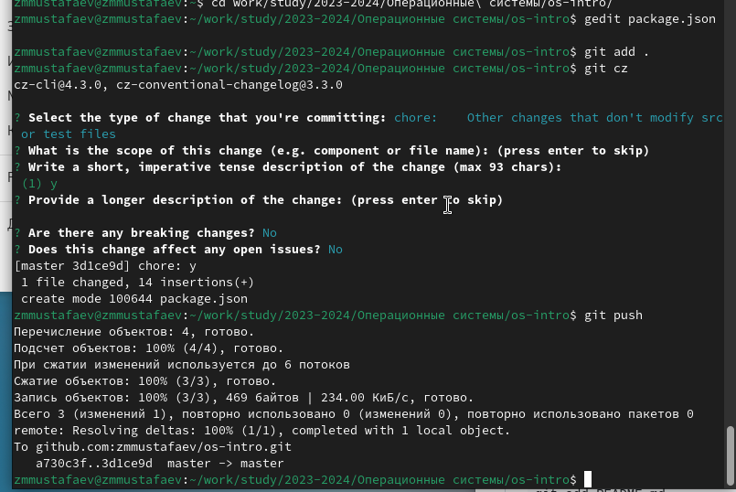{ #fig:011 width=70% height=70% }

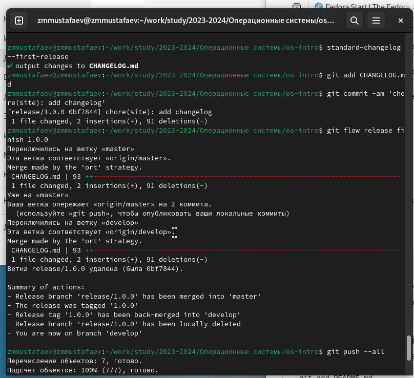{ #fig:012 width=70% height=70% }

# Вывод

Мы приобрели практические навыки взаимодействия с дополнительными функциями гитхаб.
