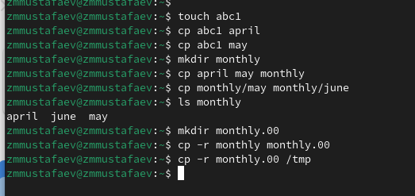
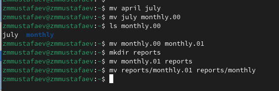
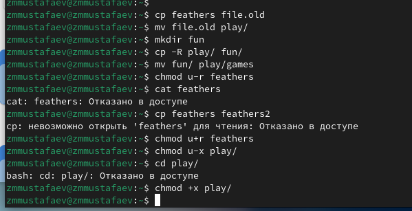

---
## Front matter
lang: ru-RU
title:  Анализ файловой структуры UNIX. Команды для работы с файлами и каталогами
author: |
		 Заур Мустафаев\inst{1}

institute: |
	\inst{1}Российский Университет Дружбы Народов

date: 16 марта, 2024, Москва, Россия

## Formatting
mainfont: PT Serif
romanfont: PT Serif
sansfont: PT Sans
monofont: PT Mono
toc: false
slide_level: 2
theme: metropolis
header-includes: 
 - \metroset{progressbar=frametitle,sectionpage=progressbar,numbering=fraction}
 - '\makeatletter'
 - '\beamer@ignorenonframefalse'
 - '\makeatother'
aspectratio: 43
section-titles: true

---

# Цели и задачи работы

## Цель лабораторной работы

Ознакомление с файловой системой Linux, её структурой, именами и содержанием каталогов. Приобретение практических навыков по применению команд для работы с файлами и каталогами, по управлению процессами, по проверке использования диска и обслуживанию файловой системы.

## Задачи лабораторной работы

1 Выполнить приимеры

2 Выполнить дествия по работе с каталогами и файлами

3 Выполнить действия с правами доступа

4 Получить дополнительные сведения при помощи справки по командам.

# Процесс выполнения лабораторной работы

## Выполнение примеров

{ #fig:001 width=70% }

## Выполнение примеров

{ #fig:002 width=70% }

## Выполнение примеров

{ #fig:003 width=70% }

## Создание директорий и копирование файлов

{ #fig:004 width=70% }

## Работа с командой chmod

{ #fig:005 width=70% }

## Файл /etc/passwd

{ #fig:006 width=70% }

## Работа с файлами и правами доступа

{ #fig:007 width=70% }

## Справка по командам

{ #fig:008 width=70% }

## Справка по командам

{ #fig:009 width=70% }

## Справка по командам

{ #fig:010 width=70% }

## Справка по командам

{ #fig:011 width=70% }

# Выводы по проделанной работе

## Вывод

В ходе данной работы мы ознакомились с файловой системой Linux, её структурой, именами и содержанием каталогов. Научились совершать базовые операции с файлами, управлять правами их доступа для пользователя и групп. Ознакомились с Анализом файловой системы. А также получили базовые навыки по проверке использования диска и обслуживанию файловой системы.

