---
## Front matter
lang: ru-RU
title:  Поиск файлов. Перенаправление ввода-вывода. Просмотр запущенных процессов
author: |
	 Заур Мустафаев\inst{1}

institute: |
	\inst{1}Российский Университет Дружбы Народов

date: 21 марта, 2024, Москва, Россия

## Formatting
mainfont: PT Serif
romanfont: PT Serif
sansfont: PT Sans
monofont: PT Mono
toc: false
slide_level: 2
theme: metropolis
header-includes: 
 - \metroset{progressbar=frametitle,sectionpage=progressbar,numbering=fraction}
 - '\makeatletter'
 - '\beamer@ignorenonframefalse'
 - '\makeatother'
aspectratio: 43
section-titles: true

---

# Цели и задачи работы

## Цель лабораторной работы

Ознакомление с файловой системой Linux, её структурой, именами и содержанием каталогов. Приобретение практических навыков по применению команд для работы с файлами и каталогами, по управлению процессами, по проверке использования диска и обслуживанию файловой системы.

## Задачи лабораторной работы

1 Изучить перенаправление ввода-вывода

2 Изучить работу фильтров

3 Изучить команду поиска

4 Ознакомиться с управлением процессами

5 Ознакомиться с командами df du

# Процесс выполнения лабораторной работы

## Перенаправление ввода-вывода

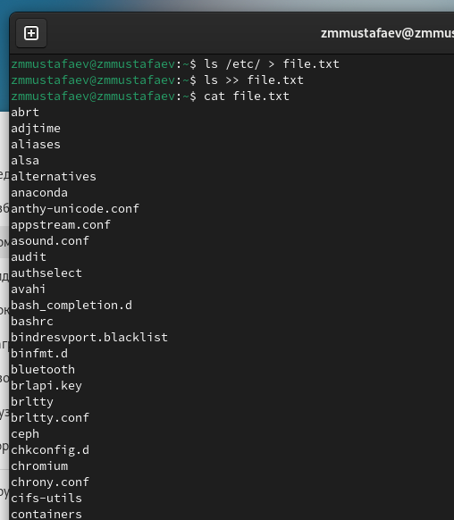{ #fig:001 height=70% width=70% }

## Работа фильтра

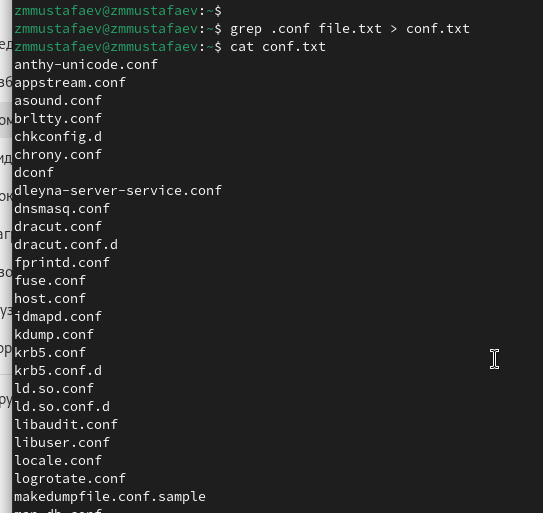{ #fig:002 height=70% width=70% }

## Команда поиска

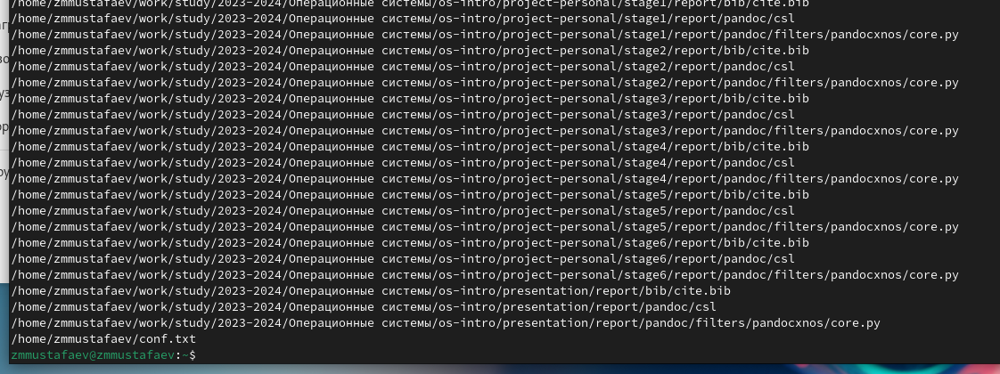{ #fig:003 height=70% width=70% }

## Команда поиска

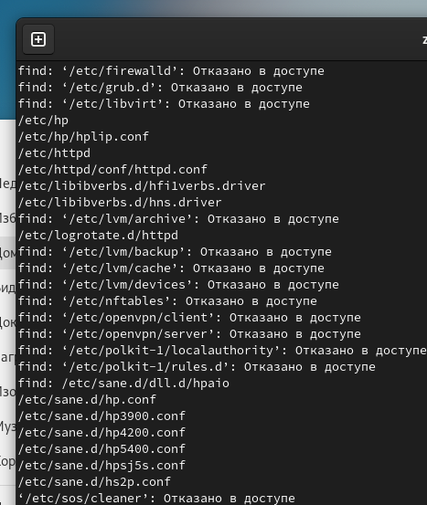{ #fig:004 height=70% width=70% }

## Управление процессами

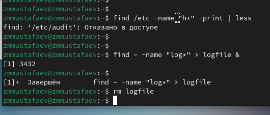{ #fig:005 height=70% width=70% }

## Управление процессами

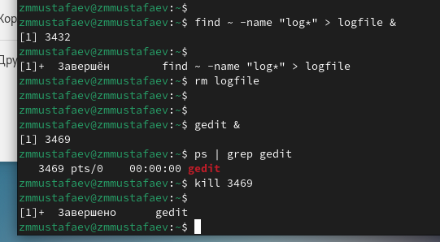{ #fig:006 height=70% width=70% }

## Команды df и du

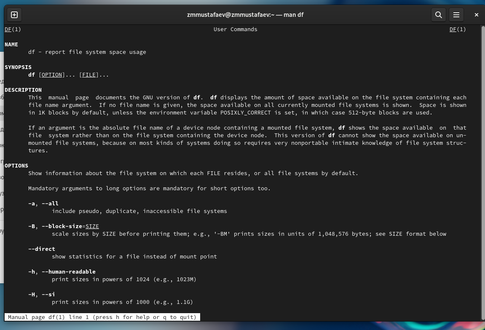{ #fig:007 height=70% width=70% }

## Команды df и du

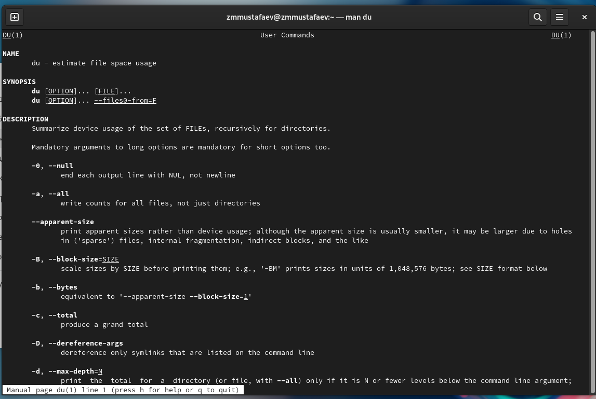{ #fig:008 height=70% width=70% }

## Команды df и du

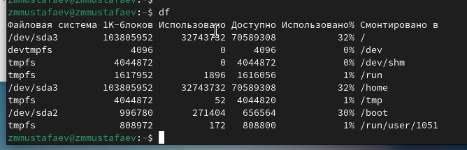{ #fig:009 height=70% width=70% }

## Команды df и du

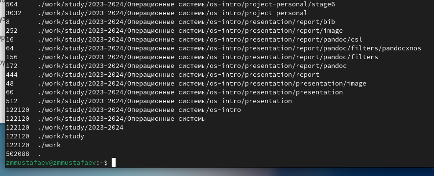{ #fig:010 height=70% width=70% }

## Команда поиска

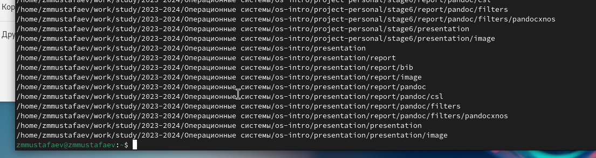{ #fig:011 height=70% width=70% }

# Выводы по проделанной работе

## Вывод

В данной работе мы ознакомились с инструментами поиска файлов и фильтрации текстовых данных. А также приобрели практические навыки по управлению процессами. 

