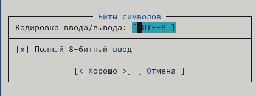

---
## Front matter
lang: ru-RU
title:  Командная оболочка Midnight Commander
author: |
	 Заур Мустафаев\inst{1}

institute: |
	\inst{1}Российский Университет Дружбы Народов

date: 28 марта, 2024, Москва, Россия

## Formatting
mainfont: PT Serif
romanfont: PT Serif
sansfont: PT Sans
monofont: PT Mono
toc: false
slide_level: 2
theme: metropolis
header-includes: 
 - \metroset{progressbar=frametitle,sectionpage=progressbar,numbering=fraction}
 - '\makeatletter'
 - '\beamer@ignorenonframefalse'
 - '\makeatother'
aspectratio: 43
section-titles: true

---

# Цели и задачи работы

## Цель лабораторной работы

Ознакомление с файловой системой Linux, её структурой, именами и содержанием каталогов. Приобретение практических навыков по применению команд для работы с файлами и каталогами, по управлению процессами, по проверке использования диска и обслуживанию файловой системы.

## Задачи лабораторной работы

1 Изучить возможности Midnight Commander

2 Изучить редактор Midnight Commander

# Процесс выполнения лабораторной работы

## Работа с Midnight Commander

{ #fig:001 width=70% height=70% }

## Работа с Midnight Commander

{ #fig:002 width=70% height=70% }

## Работа с Midnight Commander

{ #fig:003 width=70% height=70% }

## Работа с Midnight Commander

{ #fig:004 width=70% height=70% }

## Работа с Midnight Commander

{ #fig:005 width=70% height=70% }

## Работа с Midnight Commander

{ #fig:006 width=70% height=70% }

## Работа с Midnight Commander

{ #fig:007 width=70% height=70% }

## Работа с Midnight Commander

{ #fig:008 width=70% height=70% }

## Работа с Midnight Commander

{ #fig:009 width=70% height=70% }

## Работа с Midnight Commander

{ #fig:010 width=70% height=70% }

## Работа с Midnight Commander

{ #fig:011 width=70% height=70% }

## Работа с Midnight Commander

{ #fig:012 width=70% height=70% }

## Работа с Midnight Commander

{ #fig:013 width=70% height=70% }

## Работа с Midnight Commander

{ #fig:014 width=70% height=70% }

## Работа с Midnight Commander

{ #fig:015 width=70% height=70% }

## Работа с Midnight Commander

{ #fig:016 width=70% height=70% }

## Работа с Midnight Commander

{ #fig:017 width=70% height=70% }

## Работа с Midnight Commander

{ #fig:018 width=70% height=70% }

## Работа с Midnight Commander

{ #fig:019 width=70% height=70% }

## Работа с Midnight Commander

{ #fig:020 width=70% height=70% }

## Работа с Midnight Commander

{ #fig:021 width=70% height=70% }

## Работа с Midnight Commander

{ #fig:022 width=70% height=70% }

## Работа с Midnight Commander

{ #fig:023 width=70% height=70% }

## Работа с Midnight Commander

{ #fig:024 width=70% height=70% }

## Работа с Midnight Commander

{ #fig:025 width=70% height=70% }

## Работа с редактором Midnight Commander

{ #fig:026 width=70% height=70% }

## Работа с редактором Midnight Commander

{ #fig:027 width=70% height=70% }

## Работа с редактором Midnight Commander

{ #fig:028 width=70% height=70% }

## Работа с редактором Midnight Commander

{ #fig:029 width=70% height=70% }

## Работа с редактором Midnight Commander

{ #fig:030 width=70% height=70% }

## Работа с редактором Midnight Commander

{ #fig:031 width=70% height=70% }

## Работа с редактором Midnight Commander

{ #fig:032 width=70% height=70% }

## Работа с редактором Midnight Commander

{ #fig:033 width=70% height=70% }

## Работа с редактором Midnight Commander

{ #fig:034 width=70% height=70% }

# Выводы по проделанной работе

## Вывод

В данной работе мы ознакомились с инструментами поиска файлов и фильтрации текстовых данных. А также приобрели практические навыки по управлению процессами. 