---
## Front matter
lang: ru-RU
title:  Редактор Emacs
author: |
	 Заур Мустафаев\inst{1}

institute: |
	\inst{1}Российский Университет Дружбы Народов

date: 9 апреля, 2024, Москва, Россия

## Formatting
mainfont: PT Serif
romanfont: PT Serif
sansfont: PT Sans
monofont: PT Mono
toc: false
slide_level: 2
theme: metropolis
header-includes: 
 - \metroset{progressbar=frametitle,sectionpage=progressbar,numbering=fraction}
 - '\makeatletter'
 - '\beamer@ignorenonframefalse'
 - '\makeatother'
aspectratio: 43
section-titles: true

---

# Цели и задачи работы

## Цель лабораторной работы

Познакомиться с операционной системой Linux. Получить практические навыки работы с редактором Emacs. 

## Задачи лабораторной работы

1 Изучить возможности редактора Emacs

# Процесс выполнения лабораторной работы

## Выполнение работы

1. Откроем Emacs. 

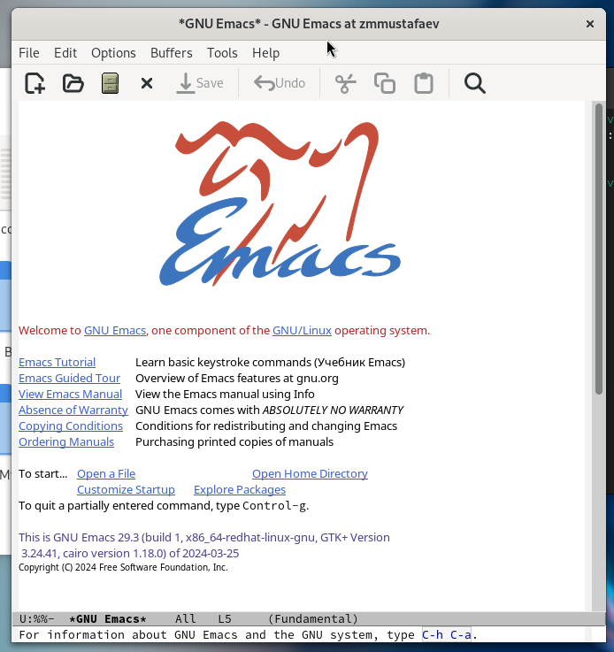{ #fig:001 width=70% height=70%}

## Выполнение работы

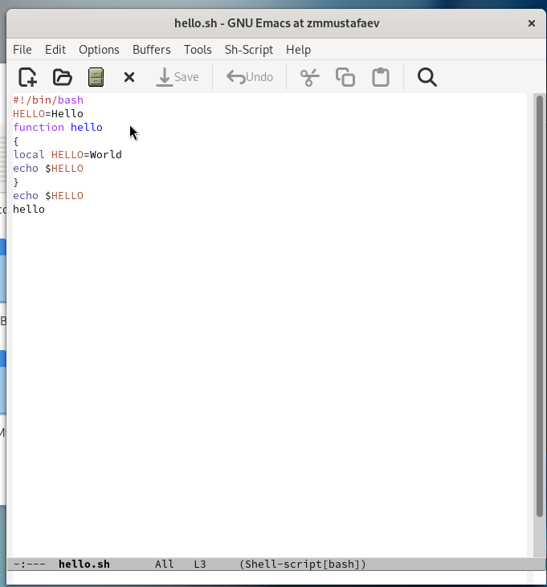{ #fig:002 width=70% height=70%}

## Выполнение работы

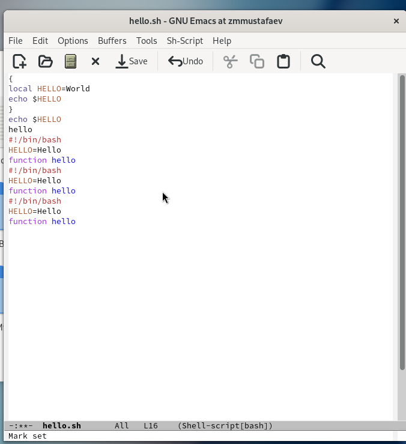{ #fig:003 width=70% height=70%}

## Выполнение работы

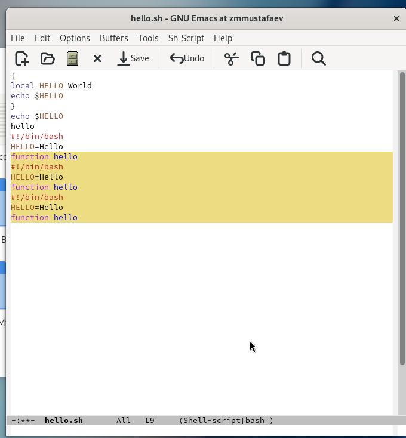{ #fig:004 width=70% height=70%}

## Выполнение работы

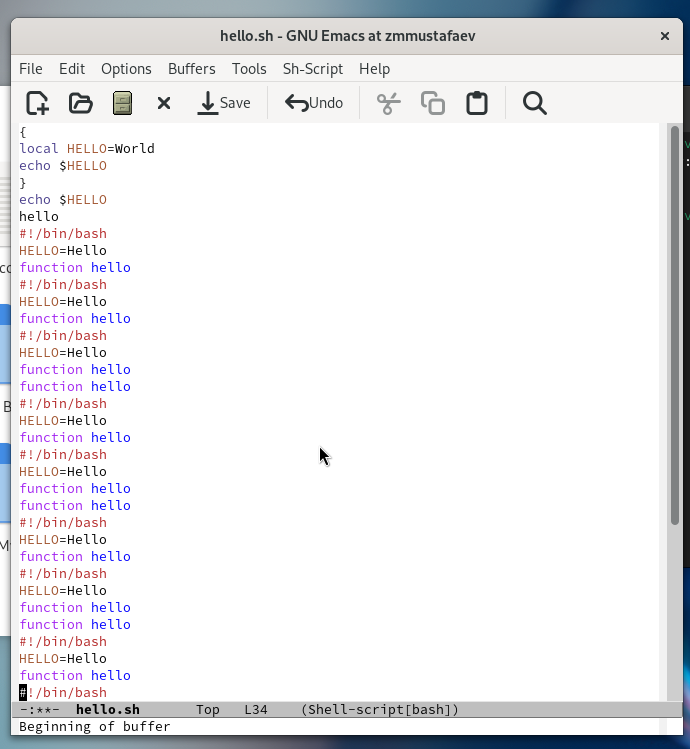{ #fig:005 width=70% height=70%}

## Выполнение работы

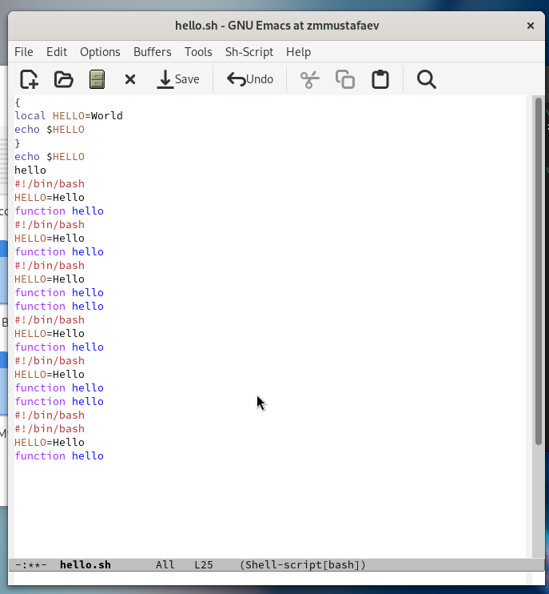{ #fig:006 width=70% height=70%}

## Выполнение работы

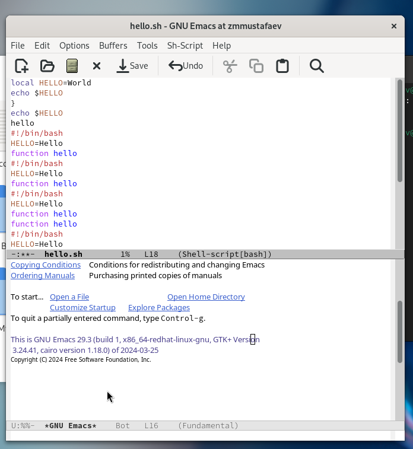{ #fig:007 width=70% height=70%}

## Выполнение работы

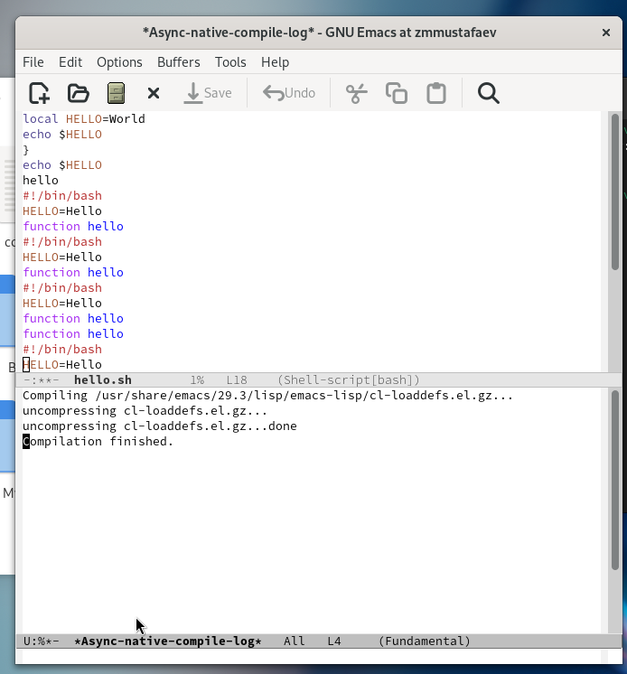{ #fig:008 width=70% height=70%}

## Выполнение работы

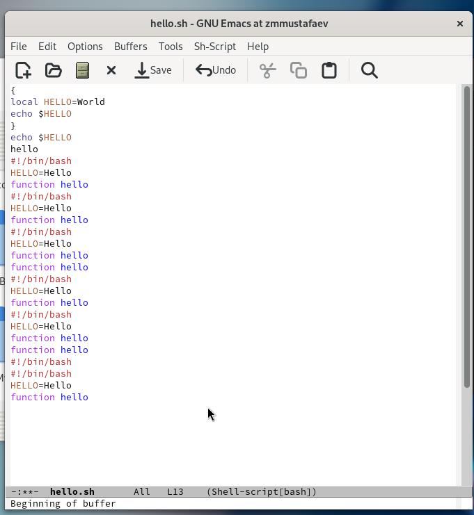{ #fig:009 width=70% height=70%}

## Выполнение работы

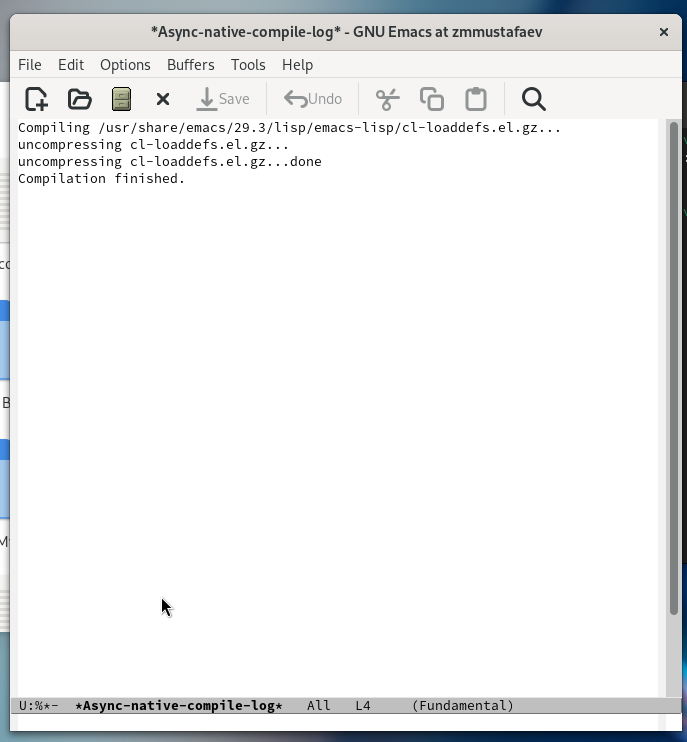{ #fig:010 width=70% height=70%}

## Выполнение работы

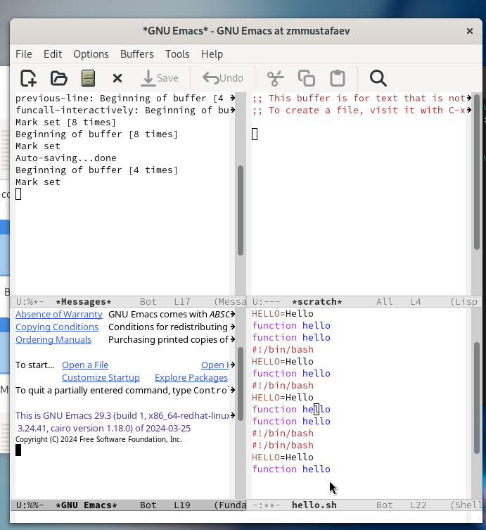{ #fig:011 width=70% height=70%}

## Выполнение работы

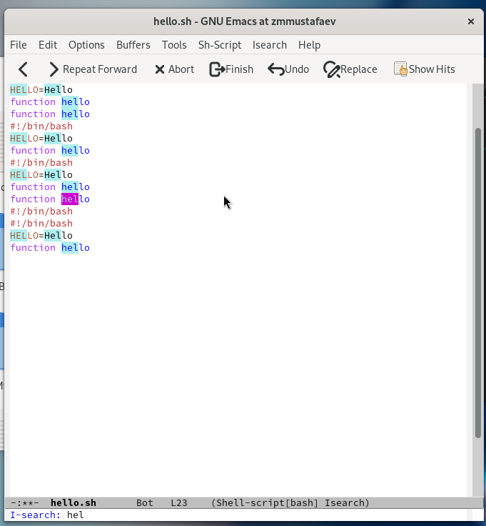{ #fig:012 width=70% height=70%}

# Выводы по проделанной работе

## Вывод

В данной работе мы познакомились с еще одним редактором операционной системой Linux. Получили практические навыки работы с редактором Emacs.
