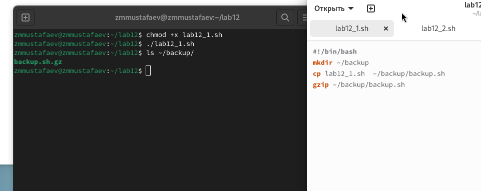
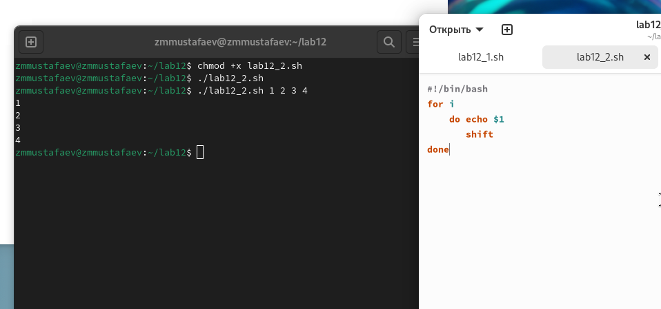
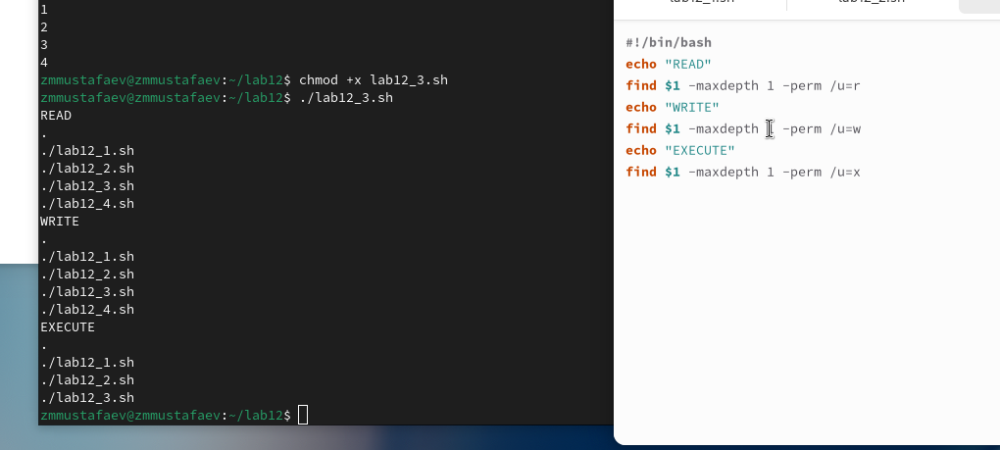
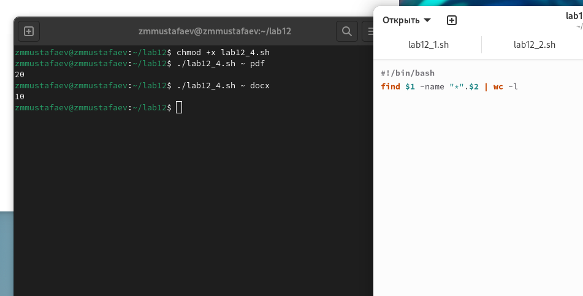

---
## Front matter
lang: ru-RU
title:  Программирование в командном процессоре ОС UNIX. Командные файлы
author: |
	 Заур Мустафаев\inst{1}

institute: |
	\inst{1}Российский Университет Дружбы Народов

date: 16 апреля, 2024, Москва, Россия

## Formatting
mainfont: PT Serif
romanfont: PT Serif
sansfont: PT Sans
monofont: PT Mono
toc: false
slide_level: 2
theme: metropolis
header-includes: 
 - \metroset{progressbar=frametitle,sectionpage=progressbar,numbering=fraction}
 - '\makeatletter'
 - '\beamer@ignorenonframefalse'
 - '\makeatother'
aspectratio: 43
section-titles: true

---

# Цели и задачи работы

## Цель лабораторной работы

Изучить основы программирования в оболочке ОС UNIX/Linux. Научиться писать небольшие командные файлы.

## Задачи лабораторной работы

1 Выполнить 4 задания

# Процесс выполнения лабораторной работы

## Выполнение работы

1. Написали скрипт, который при запуске делает резервную копию самого себя (то есть файла, в котором содержится его исходный код) в другую директорию backup в моём домашнем каталоге. При этом файл архивируется одним из архиваторов на выбор zip , bzip2 или tar . Способ использования команд архивации узнали, изучив справку.

## Выполнение работы

{ #fig:001 width=70% height=70%}

## Выполнение работы

2. Написали пример командного файла, обрабатывающего любое произвольное число аргументов командной строки, в том числе превышающее десять. Например, скрипт может последовательно распечатывать значения всех переданных аргументов

## Выполнение работы

{ #fig:002 width=70% height=70%}

## Выполнение работы

3. Написали командный файл — аналог команды ls (без использования самой этой команды и команды dir ). Он выдает информацию о нужном каталоге и выводит информацию о возможностях доступа к файлам этого каталога.

## Выполнение работы

{ #fig:003 width=70% height=70%}

## Выполнение работы

4. Написали командный файл, который получает в качестве аргумента командной строки формат файла ( .txt , .doc , .jpg , .pdf и т.д.) и вычисляет количество таких файлов в указанной директории. Путь к директории также передаётся в виде аргумента командной строки.

## Выполнение работы

{ #fig:004 width=70% height=70%}

# Выводы по проделанной работе

## Вывод

В данной работе мы изучили основы программирования в оболочке ОС UNIX/Linux. Научились писать небольшие командные файлы и скрипты на языке bush.
