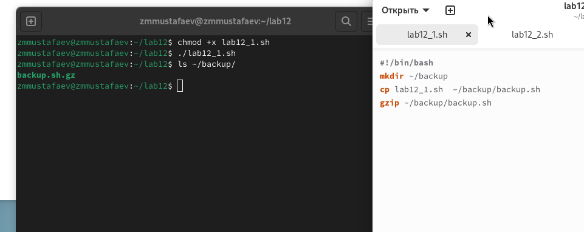
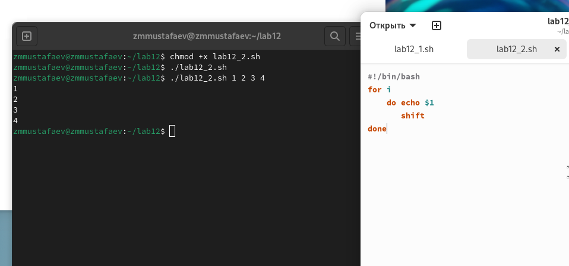
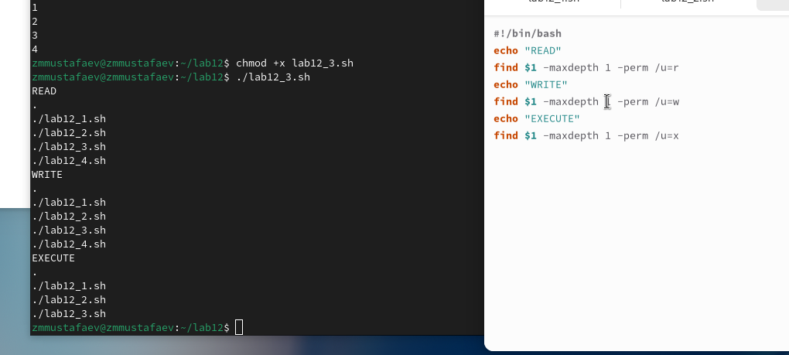

---
# Front matter
lang: ru-RU
title: "Отчёт по лабораторной работе №12"
subtitle: "Программирование в командном процессоре ОС UNIX. Командные файлы"
author: "Заур Мустафаев"

# Formatting
toc-title: "Содержание"
toc: true # Table of contents
toc_depth: 2
lof: true # List of figures
fontsize: 12pt
linestretch: 1.5
papersize: a4paper
documentclass: scrreprt
polyglossia-lang: russian
polyglossia-otherlangs: english
mainfont: PT Serif
romanfont: PT Serif
sansfont: PT Sans
monofont: PT Mono
mainfontoptions: Ligatures=TeX
romanfontoptions: Ligatures=TeX
sansfontoptions: Ligatures=TeX,Scale=MatchLowercase
monofontoptions: Scale=MatchLowercase
indent: true
pdf-engine: lualatex
header-includes:
  - \linepenalty=10 # the penalty added to the badness of each line within a paragraph (no associated penalty node) Increasing the value makes tex try to have fewer lines in the paragraph.
  - \interlinepenalty=0 # value of the penalty (node) added after each line of a paragraph.
  - \hyphenpenalty=50 # the penalty for line breaking at an automatically inserted hyphen
  - \exhyphenpenalty=50 # the penalty for line breaking at an explicit hyphen
  - \binoppenalty=700 # the penalty for breaking a line at a binary operator
  - \relpenalty=500 # the penalty for breaking a line at a relation
  - \clubpenalty=150 # extra penalty for breaking after first line of a paragraph
  - \widowpenalty=150 # extra penalty for breaking before last line of a paragraph
  - \displaywidowpenalty=50 # extra penalty for breaking before last line before a display math
  - \brokenpenalty=100 # extra penalty for page breaking after a hyphenated line
  - \predisplaypenalty=10000 # penalty for breaking before a display
  - \postdisplaypenalty=0 # penalty for breaking after a display
  - \floatingpenalty = 20000 # penalty for splitting an insertion (can only be split footnote in standard LaTeX)
  - \raggedbottom # or \flushbottom
  - \usepackage{float} # keep figures where there are in the text
  - \floatplacement{figure}{H} # keep figures where there are in the text
---

# Цель работы

Изучить основы программирования в оболочке ОС UNIX/Linux. Научиться писать небольшие командные файлы.

# Выполнение лабораторной работы

1. Написали скрипт, который при запуске делает резервную копию самого себя (то есть файла, в котором содержится его исходный код) в другую директорию backup в моём домашнем каталоге. При этом файл архивируется одним из архиваторов на выбор zip , bzip2 или tar . Способ использования команд архивации узнали, изучив справку.

Комментарий: командой cp копируем файл в директорию ~/backup/, а командой gzip исходный файл архивируется и удаляется (остаётся только архив).

{ #fig:001 width=70% height=70% }

2. Написали пример командного файла, обрабатывающего любое произвольное число аргументов командной строки, в том числе превышающее десять. Например, скрипт может последовательно распечатывать значения всех переданных аргументов

```
for i — для всех переданных аргументов
    do echo $1 — выводим первый аргумент
       shift — удаляем первый аргумент, смещаем все аргументы
done — конец цикла
```

{ #fig:002 width=70% height=70% }

3. Написали командный файл — аналог команды ls (без использования самой этой команды и команды dir ). Он выдает информацию о нужном каталоге и выводит информацию о возможностях доступа к файлам этого каталога.

Комментарий: если не использовать команду ls или команду dir, то данную задачу легко выполнить с помощью команды find, если указать ей опцию поиска файлов с определенным правом доступа

{ #fig:003 width=70% height=70% }

4. Написали командный файл, который получает в качестве аргумента командной строки формат файла ( .txt , .doc , .jpg , .pdf и т.д.) и вычисляет количество таких файлов в указанной директории. Путь к директории также передаётся в виде аргумента командной строки.

Комментарий: ищем командой find в каталоге $1 (первый аргумент) файлы заканчивающиеся "*" на нужное расширение $2 (аргумент второй) передаем вывод | в команду подсчета wc с аргументом считающим слова -l

![Задание 4]](image/04.png){ #fig:004 width=70% height=70% }

# Вывод

В данной работе мы изучили основы программирования в оболочке ОС UNIX/Linux. Научились писать небольшие командные файлы и скрипты на языке bush.

# Контрольные вопросы

1. Объясните понятие командной оболочки. Приведите примеры командных оболочек. Чем они отличаются?
Ответ: 
a)	sh — стандартная командная оболочка UNIX/Linux, содержащая базовый, 	полный набор функций
b)	csh — использующая С-подобный синтаксис команд с возможностью 	сохранения истории выполнения команд
c)	ksh — напоминает оболочку С, но операторы управления программой 	совместимы с операторами оболочки Борна
d)	bash — сокращение от Bourne Again Shell (опять оболочка Борна), в основе 	своей совмещает свойства оболочек С и Корна

2. Что такое POSIX?
Ответ: POSIX (Portable Operating System Interface for Computer Environments) — набор  стандартов описания интерфейсов взаимодействия операционной системы и прикладных программ.

3. Как определяются переменные и массивы в языке программирования bash?
Ответ: Переменные вызываются $var, где var=чему-то, указанному пользователем, неважно что бы то не было, название файла, каталога или еще чего.
Для массивов используется команда set -A

4. Каково назначение операторов let и read?
Ответ: let — вычисляет далее заданное математическое значение
read — позволяет читать значения переменных со стандартного ввода

5. Какие арифметические операции можно применять в языке программирования bash?
Ответ: Прибавление, умножение, вычисление, 	деление), сравнение значений, экспонирование и др.

6. Что означает операция (( ))?
Ответ: Это обозначение используется для облегчения программирования для условий bash 

7. Какие стандартные имена переменных Вам известны?
Ответ: Нам известны HOME, PATH, BASH, ENV, PWD, UID, OLDPWD, PPID, GROUPS, OSTYPE, PS1 - PS4, LANG, HOSTFILE, MAIL, TERM, LOGNAME, USERNAME, IFS и др.

8. Что такое метасимволы?
Ответ: Метасимволы это специальные знаки, которые могут использоваться для сокращения пути, 	поиска объекта по расширению, перед переменными, например «$» или «*» .

9. Как экранировать метасимволы?
Ответ: Добавить перед метасимволом метасимвол «\»

10. Как создавать и запускать командные файлы?
Ответ: При помощи команды chmod. Надо дать права на запуск chmod +x название файла, затем запустить bash  ./название файла
Например у нас файл lab
Пишем: 
chmod +x lab
./lab

11. Как определяются функции в языке программирования bash?
Ответ: Объединяя несколько команд с помощью function

12 Каким образом можно выяснить, является файл каталогом или обычным файлом?
Ответ: Можно задать команду на проверку диретория ли это test -d директория

13 Каково назначение команд set, typeset и unset?
Ответ: 
Set — используется для создания массивов
Unset — используется для изъятия переменной
Typeset — используется для присваивания каких-либо функций

14. Как передаются параметры в командные файлы?
Ответ: Добавлением аршументов после команды запуска bash скрипта

15. Назовите специальные переменные языка bash и их назначение.
Ответ: 
```
–	$* — отображается вся командная строка или параметры оболочки;
–	$? — код завершения последней выполненной команды;
–	$$ — уникальный идентификатор процесса, в рамках которого выполняется командный процессор;
–	$! — номер процесса, в рамках которого выполняется последняя вызванная на выполнение в командном режиме команда;
–	$- — значение флагов командного процессора;
–	${#*} — возвращает целое число — количество слов, которые были результатом
$*;
–	${#name} — возвращает целое значение длины строки в переменной name;
–	${name[n]} — обращение к n-му элементу массива;
–	${name[*]} — перечисляет все элементы массива, разделённые пробелом;
–	${name[@]} — то же самое, но позволяет учитывать символы пробелы в самих переменных;
–	${name:-value}—еслизначениепеременнойnameнеопределено,тоонобудет заменено на указанное value;
–	${name:value} — проверяется факт существования переменной;
–	${name=value} — если name не определено, то ему присваивается значение value;
–	${name?value} — останавливает выполнение, если имя переменной не определено, и выводит value как сообщение об ошибке;
–	${name+value} — это выражение работает противоположно ${name-value}. Если переменная определена, то подставляется value;
–	${name#pattern} — представляет значение переменной name с удалённым самым коротким левым образцом (pattern);
–	${#name[*]}и${#name[@]}—этивыражениявозвращаютколичествоэлементов в массиве name.
```