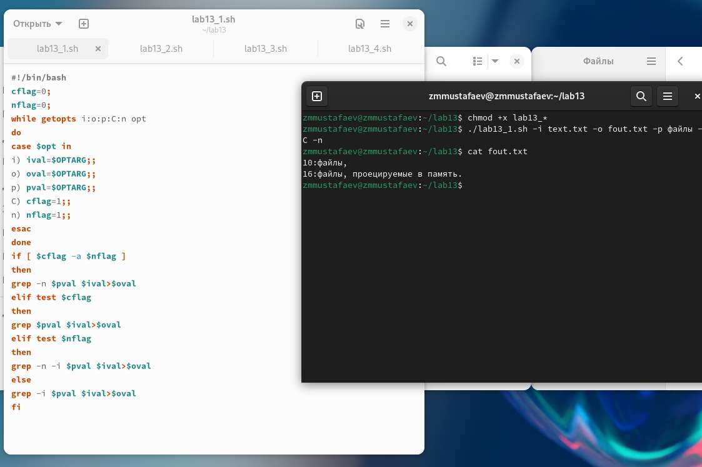
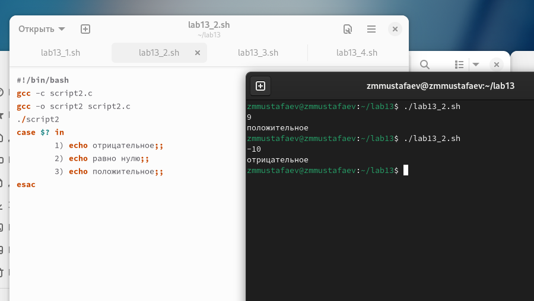
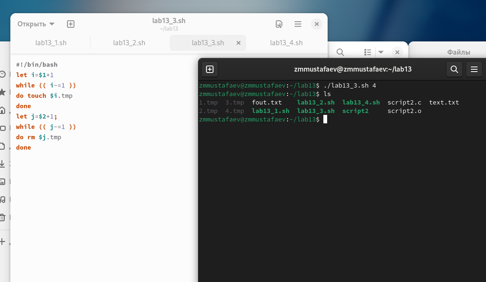
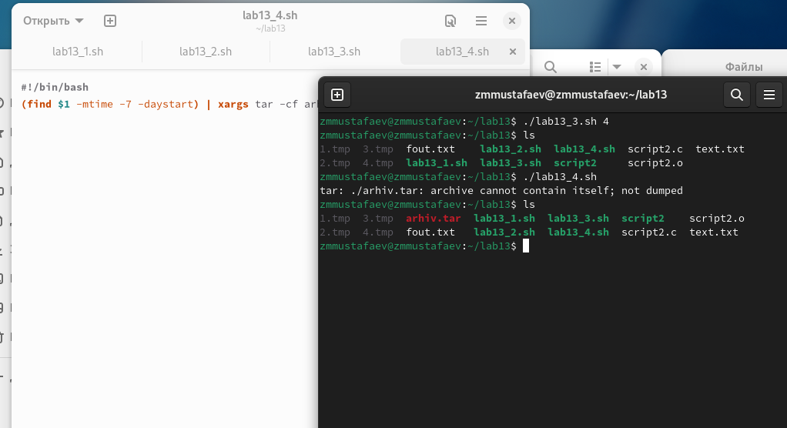

---
## Front matter
lang: ru-RU
title:  Программирование в командном процессоре ОС UNIX. Ветвления и циклы
author: |
	 Заур Мустафаев\inst{1}

institute: |
	\inst{1}Российский Университет Дружбы Народов

date: 25 апреля, 2024, Москва, Россия

## Formatting
mainfont: PT Serif
romanfont: PT Serif
sansfont: PT Sans
monofont: PT Mono
toc: false
slide_level: 2
theme: metropolis
header-includes: 
 - \metroset{progressbar=frametitle,sectionpage=progressbar,numbering=fraction}
 - '\makeatletter'
 - '\beamer@ignorenonframefalse'
 - '\makeatother'
aspectratio: 43
section-titles: true

---

# Цели и задачи работы

## Цель лабораторной работы

Изучить основы программирования в оболочке ОС UNIX. Научится писать более сложные командные файлы с использованием логических управляющих конструкций и циклов. 

## Задачи лабораторной работы

1 Выполнить 4 задания

# Процесс выполнения лабораторной работы

## Выполнение работы

1. Используя команды getopts grep напишем командный файл, который анализирует командную строку с ключами и выполним его: 
	-i inputfile — прочитать данные из указанного файла; 
	-o outputfile — вывести данные в указанный файл; 
	-p шаблон — указать шаблон для поиска; 
	-C — различать большие и малые буквы; 
	-n — выдавать номера строк; 

а затем ищет в указанном файле нужные строки

## Выполнение работы

{ #fig:001 width=70% height=70%}

## Выполнение работы

2. Напишем сначала на языке Си программу, которая вводит число и определяет, является ли оно больше нуля, меньше нуля или равно нулю. Затем завершим программу при помощи функции exit(n), передавая информацию о коде завершения в оболочку. Командный файл вызовет эту программу и, проанализировав с помощью команды $?, выдаст сообщение о том, какое число было введено

## Выполнение работы

{ #fig:002 width=70% height=70%}

## Выполнение работы

3. Напишем командный файл, создающий указанное число файлов, пронумерованных последовательно от 1 до N  

## Выполнение работы

{ #fig:003 width=70% height=70%}

## Выполнение работы

4. Напишем командный файл, который с помощью команды tar запаковывает в архив все файлы в указанной директории. Модифицируем его так, чтобы запаковывались только те файлы, которые были изменены менее недели тому назад. 

## Выполнение работы

{ #fig:004 width=70% height=70%}

# Выводы по проделанной работе

## Вывод

В данной работе мы изучили основы программирования в оболочке ОС UNIX и писать более сложные командные файлы с использованием логических управляющих конструкций и циклов. 
