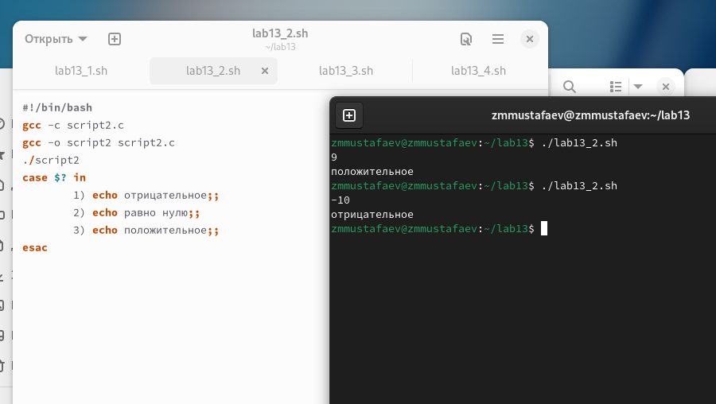
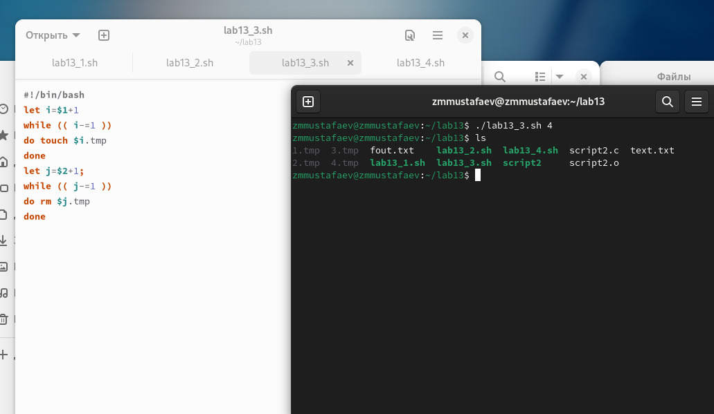
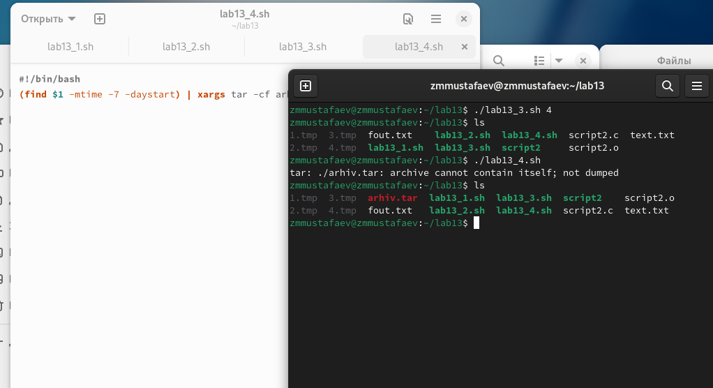

---
# Front matter
lang: ru-RU
title: "Отчёт по лабораторной работе №13"
subtitle: "Программирование в командном процессоре ОС UNIX. Ветвления и циклы"
author: "Заур Мустафаев"

# Formatting
toc-title: "Содержание"
toc: true # Table of contents
toc_depth: 2
lof: true # List of figures
fontsize: 12pt
linestretch: 1.5
papersize: a4paper
documentclass: scrreprt
polyglossia-lang: russian
polyglossia-otherlangs: english
mainfont: PT Serif
romanfont: PT Serif
sansfont: PT Sans
monofont: PT Mono
mainfontoptions: Ligatures=TeX
romanfontoptions: Ligatures=TeX
sansfontoptions: Ligatures=TeX,Scale=MatchLowercase
monofontoptions: Scale=MatchLowercase
indent: true
pdf-engine: lualatex
header-includes:
  - \linepenalty=10 # the penalty added to the badness of each line within a paragraph (no associated penalty node) Increasing the value makes tex try to have fewer lines in the paragraph.
  - \interlinepenalty=0 # value of the penalty (node) added after each line of a paragraph.
  - \hyphenpenalty=50 # the penalty for line breaking at an automatically inserted hyphen
  - \exhyphenpenalty=50 # the penalty for line breaking at an explicit hyphen
  - \binoppenalty=700 # the penalty for breaking a line at a binary operator
  - \relpenalty=500 # the penalty for breaking a line at a relation
  - \clubpenalty=150 # extra penalty for breaking after first line of a paragraph
  - \widowpenalty=150 # extra penalty for breaking before last line of a paragraph
  - \displaywidowpenalty=50 # extra penalty for breaking before last line before a display math
  - \brokenpenalty=100 # extra penalty for page breaking after a hyphenated line
  - \predisplaypenalty=10000 # penalty for breaking before a display
  - \postdisplaypenalty=0 # penalty for breaking after a display
  - \floatingpenalty = 20000 # penalty for splitting an insertion (can only be split footnote in standard LaTeX)
  - \raggedbottom # or \flushbottom
  - \usepackage{float} # keep figures where there are in the text
  - \floatplacement{figure}{H} # keep figures where there are in the text
---

# Цель работы

Изучить основы программирования в оболочке ОС UNIX. Научится писать более сложные командные файлы с использованием логических управляющих конструкций и циклов. 

# Выполнение лабораторной работы

1. Используя команды getopts grep напишем командный файл, который анализирует командную строку с ключами и выполним его: 
	-i inputfile — прочитать данные из указанного файла; 
	-o outputfile — вывести данные в указанный файл; 
	-p шаблон — указать шаблон для поиска; 
	-C — различать большие и малые буквы; 
	-n — выдавать номера строк; 

а затем ищет в указанном файле нужные строки
 
```
#!/bin/bash
cflag=0;
nflag=0;
while getopts i:o:p:C:n opt
do
case $opt in
i) ival=$OPTARG;;
o) oval=$OPTARG;;
p) pval=$OPTARG;;
C) cflag=1;;
n) nflag=1;;
esac
done
if [ $cflag -a $nflag ]
then
grep -n $pval $ival>$oval
elif test $cflag
then
grep $pval $ival>$oval
elif test $nflag
then
grep -n -i $pval $ival>$oval
else
grep -i $pval $ival>$oval
fi
```

{ #fig:001 width=70% }

2. Напишем сначала на языке Си программу, которая вводит число и определяет, является ли оно больше нуля, меньше нуля или равно нулю. Затем завершим программу при помощи функции exit(n), передавая информацию о коде завершения в оболочку. Командный файл вызовет эту программу и, проанализировав с помощью команды $?, выдаст сообщение о том, какое число было введено

```
#!/bin/bash
gcc -c script2.c
gcc -o script2 script2.c
./script2
case $? in
	1) echo отрицательное;;
	2) echo равно нулю;;
	3) echo положительное;;
esac
```

{ #fig:002 width=70% }

3. Напишем командный файл, создающий указанное число файлов, пронумерованных последовательно от 1 до N  

```
#!/bin/bash
let i=$1+1
while (( i-=1 ))
do touch $i.tmp
done
let j=$2+1;
while (( j-=1 ))
do rm $j.tmp
done
```

{ #fig:003 width=70% }

4. Напишем командный файл, который с помощью команды tar запаковывает в архив все файлы в указанной директории. Модифицируем его так, чтобы запаковывались только те файлы, которые были изменены менее недели тому назад. 

```
#!/bin/bash
(find $1 -mtime -7 -daystart) | xargs tar -cf arhiv.tar
```

{ #fig:004 width=70% }

# Вывод

В данной работе мы изучили основы программирования в оболочке ОС UNIX и писать более сложные командные файлы с использованием логических управляющих конструкций и циклов. 

# Контрольные вопросы

1. Каково предназначение команды getopts? 
Ответ: Создание по пользовательским аргументам.
 
2. Какое отношение метасимволы имеют к генерации имён файлов? 
Ответ: Используют как файлы так и аргументы. 

3. Какие операторы управления действиями вы знаете? 
Ответ: If, else, elif, fi, while, do, done, until, do, done, for, in, do, done, case, in, esac 

4. Какие операторы используются для прерывания цикла? 
Ответ:  
a) for – будет выполнять действие до тех пор, пока есть объекты для выполнения. 
b) while – выполняет действие до тех пор, пока условие является истинным.  
c) until – будет выполнятся пока условие не станет правдиво. 

5. Для чего нужны команды false и true? 
Ответ: until – будет выполняться до тех пор, пока условие не станет true, т.е. пока оно не станет false. 

6. Что означает строка if test -f man$s/$i.$s, встреченная в командном файле? 
Ответ: Проверяет если существует файл его размерность и тип c двумя разными расширениями, заменяя через переменные. 

7. Объясните различия между конструкциями while и until. 
Ответ:  
while – выполняет действие до тех пор, пока условие является истинным.  
until – будет выполняться до тех пор, пока условие не станет истинным, т.е. пока оно false. 
